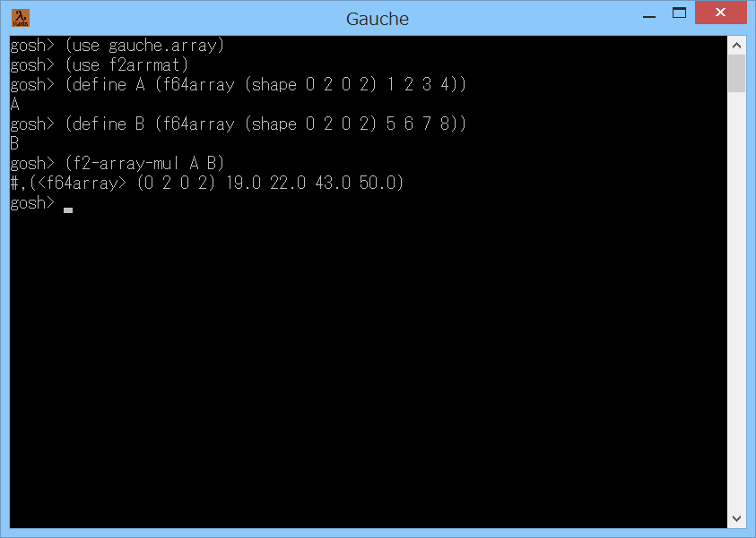

# f2arrmat



## 概要
- Gauche で、行列 (2次元の f64array) を扱うためのモジュールです。  
  gauche.array, eigenmat, blasmat モジュールよりも後に  
  読み込んで使用することを想定しています。


## インストール方法
  - f2arrmat.scm を Gauche でロード可能なフォルダにコピーします。  
    (例えば (gauche-site-library-directory) で表示されるフォルダ等)


## 使い方
- 基本的な使い方は、以下のようになります。
  ```
    (use gauche.array)        ; 標準の行列演算モジュールをロードします。
    (use f2arrmat)            ; 本モジュールをロードします。
    (define A (f64array (shape 0 2 0 2) 1 2 3 4)) ; 2x2 の 行列A を作成します。
    (define B (f64array (shape 0 2 0 2) 5 6 7 8)) ; 2x2 の 行列B を作成します。
    (define C (f2-array-mul A B)) ; 行列A と 行列B の積を計算して、行列C に格納します。
    (print C)                 ; 行列C の内容を表示します。
    (print (array-ref C 0 0)) ; 行列C の左上の要素の値を表示します。
    (print (array-ref C 0 1)) ; 行列C の右上の要素の値を表示します。
  ```
- 使用可能な手続きを、以下に示します。  
  (現状、本モジュールは、標準の gauhce.array モジュールにおける  
  2次元の f64array のみ演算が可能です)

  - `(f2-array-cache-on)`  
    `(f2-array-cache-off)`  
    行列のキャッシュの使用(ON)/未使用(OFF)を設定します。デフォルトは使用(ON)です。  
    (行列のキャッシュについては、後述の make-f2-array の説明を参照ください)

  - `(make-f2-array ns ne ms me [maybe-init])`  
    行列 (2次元のf64array) を生成します。  
    ns ne ms me には、行列の shape を指定します。  
    例えば、2x3 の行列を生成する場合には、  
    `(make-f2-array 0 2 0 3)` のように指定します。  
    maybe-init には要素の初期値を指定します。  
    maybe-init は省略可能です。省略した場合は 0 を指定したことになります。  
    本手続きは、生成した行列をキャッシュに保存します。  
    そして、同一サイズの行列の生成については、キャッシュのコピーを返すことで高速化をはかります。  
    もし、メモリ使用量やマルチスレッド等の関係で、本処理が不要な場合には、  
    事前に `(f2-array-cache-off)` を呼び出してください。  
    (本手続きは、他の手続きの内部でも使用しています)

  - `(make-f2-array-same-shape A [maybe-init])`  
    行列A と同じ shape の行列 (2次元のf64array) を生成します。  
    maybe-init には要素の初期値を指定します。  
    maybe-init は省略可能です。省略した場合は 0 を指定したことになります。

  - `(f2-array ns ne ms me . inits)`  
    初期化データを指定して、行列 (2次元のf64array) を生成します。  
    ns ne ms me には、行列の shape を指定します。  
    inits には、行列の要素の数だけ初期化データを並べます。  
    例えば、2x3 の行列を生成する場合には、  
    `(f2-array 0 2 0 3 1 2 3 4 5 6)` のように指定します。

  - `(f2-array-ref A i j)`  
    行列A の位置 (i,j) の要素を返します。

  - `(f2-array-set! A i j d)`  
    行列A の位置 (i,j) の要素を d にします (行列A は変更されます)。  
    戻り値は未定義です。

  - `(f2-array-fill! A d)`  
    行列A の要素をすべて d にします (行列A は変更されます)。  
    戻り値は未定義です。

  - `(f2-array-copy A)`  
    行列A のコピーを返します。

  - `(f2-array-copy! B A)`  
    行列A の内容を 行列B にコピーします (行列B は変更されます)。  
    戻り値は未定義です。

  - `(f2-array-map proc A B ...)`  
    行列A, 行列B ... の要素を引数として proc を呼び出し、結果の行列を作って返します。

  - `(f2-array-map! C proc A B ...)`  
    行列A, 行列B ... の要素を引数として proc を呼び出し、結果を 行列C に格納します (行列C は変更されます)。  
    戻り値は未定義です。

  - `(f2-array-nearly=? A B [precision])`  
    行列A と 行列B の各要素がほぼ等しければ #t を返します。  
    そうでなければ #f を返します。  
    precision には、比較の精度を示す値を指定します。  
    (precision の定義については、Eigen ライブラリ の isApprox メソッドの説明を参照してください)  
    precision は省略可能です。省略した場合は 1e-12 を指定したことになります。  
    注意) この手続きには、「A と B のどちらかが "誤差のないゼロ行列" のとき、  
    A と B の両方が "誤差のないゼロ行列" の場合にのみ #t を返す」という特徴があります。  
    このため、誤差を許す「"誤差のないゼロ行列" との比較」を行いたい場合には、  
    後述の f2-array-nearly-zero? を使用してください。

  - `(f2-array-nearly-zero? A [precision])`  
    行列A が ゼロ行列 に近ければ #t を返します。  
    そうでなければ #f を返します。  
    precision には、比較の精度を示す値を指定します。  
    (precision の定義については、Eigen ライブラリ の isMuchSmallerThan メソッドの説明を参照してください)  
    precision は省略可能です。省略した場合は 1e-12 を指定したことになります。

  - `(f2-array-add-elements A B/r ...)`  
    `(f2-array-add-elements! C A B/r ...)`  
    行列A, 行列B/実数r, ... の和を計算して返します。  
    `!` がついたものは、結果を 行列C に格納して返します (行列C は変更されます)。  
    (行列C は計算の対象にはなりません。結果を格納するためだけに使用されます)

  - `(f2-array-sub-elements A B/r ...)`  
    `(f2-array-sub-elements! C A B/r ...)`  
    行列A, 行列B/実数r, ... の差を計算して返します。  
    `!` がついたものは、結果を 行列C に格納して返します (行列C は変更されます)。  
    (行列C は計算の対象にはなりません。結果を格納するためだけに使用されます)

  - `(f2-array-mul A B)`  
    `(f2-array-mul! C A B)`  
    行列A と 行列B の積を計算して返します。  
    `!` がついたものは、結果を 行列C に格納して返します (行列C は変更されます)。  
    (行列C は計算の対象にはなりません。結果を格納するためだけに使用されます)

  - `(f2-array-mul-elements A B/r ...)`  
    `(f2-array-mul-elements! C A B/r ...)`  
    行列A, 行列B/実数r, ... の要素の積を計算して返します。  
    `!` がついたものは、結果を 行列C に格納して返します (行列C は変更されます)。  
    (行列C は計算の対象にはなりません。結果を格納するためだけに使用されます)

  - `(f2-array-div-elements A B/r ...)`  
    `(f2-array-div-elements! C A B/r ...)`  
    行列A, 行列B/実数r, ... の要素の割り算を計算して返します。  
    `!` がついたものは、結果を 行列C に格納して返します (行列C は変更されます)。  
    (行列C は計算の対象にはなりません。結果を格納するためだけに使用されます)

  - `(f2-array-pow A r)`  
    `(f2-array-pow! B A r)`  
    行列A の要素を 実数r を用いてr乗した結果を返します。  
    `!` がついたものは、結果を 行列B に格納して返します (行列B は変更されます)。

  - `(f2-array-exp A)`  
    `(f2-array-exp! B A)`  
    行列A の要素を指数として、自然対数の底eのべき乗を計算して返します。  
    `!` がついたものは、結果を 行列B に格納して返します (行列B は変更されます)。

  - `(f2-array-log A)`  
    `(f2-array-log! B A)`  
    行列A の要素に対して、自然対数を計算して返します。  
    `!` がついたものは、結果を 行列B に格納して返します (行列B は変更されます)。

  - `(f2-array-sigmoid A)`  
    `(f2-array-sigmoid! B A)`  
    行列A の要素に対して、シグモイド関数 を計算して返します。  
    `!` がついたものは、結果を 行列B に格納して返します (行列B は変更されます)。

  - `(f2-array-relu A)`  
    `(f2-array-relu! B A)`  
    行列A の要素に対して、ReLU関数 を計算して返します。  
    `!` がついたものは、結果を 行列B に格納して返します (行列B は変更されます)。

  - `(f2-array-step A)`  
    `(f2-array-step! B A)`  
    行列A の要素に対して、ステップ関数 を計算して返します。  
    `!` がついたものは、結果を 行列B に格納して返します (行列B は変更されます)。

  - `(f2-array-sum A)`  
    行列A の要素の和を計算して返します。

  - `(f2-array-min A)`  
    行列A の要素の最小値を返します。

  - `(f2-array-max A)`  
    行列A の要素の最大値を返します。

  - `(f2-array-mean A)`  
    行列A の要素の平均値を計算して返します。

  - `(f2-array-trace A)`  
    行列A のトレースを計算して返します。

  - `(f2-array-determinant A)`  
    行列A の行列式を計算して返します。

  - `(f2-array-transpose A)`  
    `(f2-array-transpose! B A)`  
    行列A の転置行列を返します。  
    `!` がついたものは、結果を 行列B に格納して返します (行列B は変更されます)。

  - `(f2-array-inverse A)`  
    `(f2-array-inverse! B A)`  
    行列A の逆行列を計算して返します。  
    `!` がついたものは、結果を 行列B に格納して返します (行列B は変更されます)。  
    現状、逆行列が存在しない場合の動作が、eigenmat モジュールの有無によって変化します。  
    eigenmat モジュールがある場合には、要素が +inf.0 や -inf.0 の行列が返ります。  
    eigenmat モジュールがない場合には、#f が返ります。

  - `(f2-array-row A i)`  
    `(f2-array-row! B A i)`  
    行列A から i 行を抜き出して返します。  
    `!` がついたものは、結果を 行列B に格納して返します (行列B は変更されます)。

  - `(f2-array-col A j)`  
    `(f2-array-col! B A j)`  
    行列A から j 列を抜き出して返します。  
    `!` がついたものは、結果を 行列B に格納して返します (行列B は変更されます)。

  - `(f2-array-ra+b! alpha A B)`  
    実数alpha と 行列A, B に対して、  
    B = alpha A + B を計算して返します (行列B は変更されます)。  
    (本手続きは blasmat モジュールが存在する場合に高速化されます)

  - `(f2-array-ab+c! A B C alpha beta trans-A trans-B)`  
    行列A, B, C と 実数alpha, beta に対して、  
    C = alpha A B + beta C を計算して返します。  
    trans-A に #t を指定すると、行列A を転置して計算を行います。  
    trans-A に #f を指定すると、行列A を転置しません。  
    trans-B に #t を指定すると、行列B を転置して計算を行います。  
    trans-B に #f を指定すると、行列B を転置しません。  
    (行列A, B は変更されません。行列C は変更されます)  
    (本手続きは blasmat モジュールが存在する場合に高速化されます)


## その他 注意事項等
1. 本モジュールは、標準の gauche.array モジュールの内部情報を使用し、  
   また、一部処理を上書きします。  
   このため、Gauche の将来の変更で動作しなくなる可能性があります。

2. 本モジュールは、eigenmat モジュール ( https://github.com/Hamayama/eigenmat )  
   および、blasmat モジュール ( https://github.com/Hamayama/blasmat )  
   が存在すれば、使用します (一部の演算が高速化されます)。


## 環境等
- OS
  - Windows 8.1 (64bit)
- 環境
  - MSYS2/MinGW-w64 (64bit/32bit) (gcc version 7.3.0 (Rev2, Built by MSYS2 project))
- 言語
  - Gauche v0.9.7

## 履歴
- 2019-3-20  v1.00 (初版)
- 2019-3-21  v1.01 コメント変更のみ
- 2019-3-21  v1.02 f2-array-ra+b,f2-array-ab+cを削除  
  f2-array-ra+b!,f2-array-ab+c!の引数を変更  
  行列の情報取得をマクロ化
- 2019-3-22  v1.03 f2-array-div-elements,f2-array-div-elements!,  
  f2-array-pow,f2-array-pow!,f2-array-exp,f2-array-exp!,  
  f2-array-log,f2-array-log!,f2-array-sum,f2-array-min,  
  f2-array-max,f2-array-mean,f2-array-trace,f2-array-determinant,  
  f2-array-inverseを追加


(2019-3-21)
